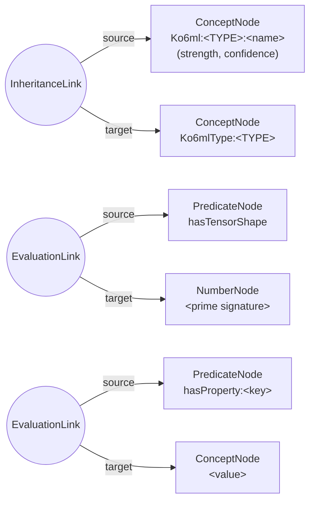

# Phase 1: ko6ml Primitives & Foundational Hypergraph Encoding

Bidirectional translation between **ko6ml agentic primitives** and
**AtomSpace hypergraph patterns**, plus the tensor fragment
architecture that grounds every primitive in the canonical shape
`[modality, depth, context, salience, autonomy_index]`.

Implemented by:

| Module | Purpose |
|---|---|
| `libgnucash/engine/gnc-ko6ml-translation.h/.cpp` | ko6ml vocabulary, tensor fragments, prime-factorization signatures, hypergraph & Scheme translation (GLib-only, engine-independent) |
| `libgnucash/engine/gnc-ko6ml-atomspace.h/.cpp` | Instantiation of hypergraph fragments as real atoms in the cognitive AtomSpace (`gnc-cognitive-accounting.h`) |
| `libgnucash/engine/test/test-ko6ml-translation.cpp` | Comprehensive gtest suite (vocabulary, tensor architecture, round trips, AtomSpace instantiation, benchmark) |
| `phase1-ko6ml-roundtrip-demo.cpp` + `test-phase1-ko6ml-roundtrip.sh` | Standalone automated verification pipeline and hypergraph DOT visualization tool |

## ko6ml Primitive Vocabulary

The atomic agentic vocabulary consists of eight primitive types:

`AGENT`, `STATE`, `ACTION`, `PERCEPT`, `MEMORY`, `GOAL`, `CONSTRAINT`,
`RELATION`

Each `GncKo6mlPrimitive` instance carries a type, a unique name, a
tensor fragment shape, an OpenCog-style truth value
(strength/confidence in `[0,1]`), and an open set of string
properties.

## Tensor Fragment Architecture

### Canonical shape

Every agent/state is encoded with the 5-dimensional tensor shape:

```
[modality, depth, context, salience, autonomy_index]
```

| Dimension | Meaning | Prime | Bound |
|---|---|---|---|
| `modality` | Sensory/data modality count | 2 | 1–8 |
| `depth` | Hypergraph recursion depth | 3 | 1–16 |
| `context` | Contextual embedding width | 5 | 1–16 |
| `salience` | Attention salience resolution | 7 | 1–8 |
| `autonomy_index` | Agent autonomy resolution | 11 | 1–8 |

`gnc_ko6ml_tensor_shape_validate()` enforces the bounds and returns a
human-readable diagnostic on failure.
`gnc_ko6ml_tensor_fragment_create()` allocates a dense row-major
element buffer of `modality × depth × context × salience ×
autonomy_index` doubles with bounds-checked accessors.

### Prime factorization signature (Gödel encoding)

Each shape maps to a unique 128-bit integer signature:

```
signature = 2^modality · 3^depth · 5^context · 7^salience · 11^autonomy_index
```

Uniqueness follows from the fundamental theorem of arithmetic. The
canonical bounds guarantee the maximum signature
(`2^8 · 3^16 · 5^16 · 7^8 · 11^8 ≈ 2.0×10^36`) fits in 128 bits, so
the encoding is exact and lossless. The inverse mapping
(`gnc_ko6ml_tensor_shape_from_signature()`) factorizes by repeated
prime division and rejects any integer containing prime factors
outside the basis `{2, 3, 5, 7, 11}` or exponents outside the bounds.

Example: shape `[3, 4, 5, 2, 6]` →
`2^3 · 3^4 · 5^5 · 7^2 · 11^6 = 175783140225000`.

## Hypergraph Fragment Encoding

`gnc_ko6ml_primitive_to_hypergraph()` translates a primitive into an
ordered fragment of AtomSpace-compatible atoms (links reference
earlier atoms by index, so the ordering is a valid topological order):



- The **root ConceptNode** `Ko6ml:<TYPE>:<name>` carries the
  primitive's truth value.
- The **InheritanceLink** to `Ko6mlType:<TYPE>` encodes type
  membership.
- The **hasTensorShape EvaluationLink** binds the prime-factorization
  signature; decoding recovers the exact shape by inverse
  factorization.
- One **hasProperty:<key> EvaluationLink** per property, emitted in
  sorted key order for deterministic encoding.

`gnc_ko6ml_hypergraph_to_primitive()` performs the reverse
translation, verifying the structural contract (root concept, type
inheritance, valid signature) and rejecting malformed fragments.
`gnc_ko6ml_verify_hypergraph_roundtrip()` asserts structural equality
after a full round trip.

### AtomSpace instantiation

`gnc_ko6ml_fragment_to_atomspace()` materialises every fragment atom
in the live cognitive AtomSpace via the public API
(`gnc_atomspace_create_concept_node()`,
`gnc_atomspace_create_predicate_node()`,
`gnc_atomspace_create_inheritance_link()`,
`gnc_atomspace_create_evaluation_link()`), applying node truth values
with `gnc_atomspace_set_truth_value()`. It returns the root concept
handle and, optionally, the full handle array in fragment order.
`gnc_ko6ml_primitive_to_atomspace()` composes translation and
instantiation in one call.

## Scheme Cognitive Grammar Adapter

`gnc_ko6ml_primitive_to_scheme()` emits a lossless s-expression:

```scheme
(Ko6mlPrimitive
  (type "AGENT")
  (name "bookkeeper")
  (tensor-shape (modality 2) (depth 3) (context 4)
                (salience 2) (autonomy-index 5))
  (truth (strength 0.87) (confidence 0.65))
  (properties (prop "role" "double-entry")))
```

- Strings are escaped (`"` and `\`) and doubles are rendered with 17
  significant digits in the C locale, so numeric round trips are
  bit-exact.
- `gnc_ko6ml_primitive_from_scheme()` is a full recursive-descent
  s-expression parser (no regexes, no mocks) that validates the
  document structure, the primitive type, the tensor shape bounds and
  the truth-value fields, returning `NULL` on any malformed input.
- `gnc_ko6ml_verify_scheme_roundtrip()` asserts structural equality
  after encode → parse.

## Verification Protocol

### Test suite

`libgnucash/engine/test/test-ko6ml-translation.cpp` (built by
`gnc_add_test` as `test-ko6ml-translation`) covers:

- vocabulary name/enum round trips for all eight primitive types and
  rejection of invalid names
- per-dimension shape bound enforcement (zero and above-max for each
  of the five dimensions)
- known-value signature check, corner-sweep inverse factorization
  (3^5 = 243 shape combinations), rejection of non-canonical
  signatures (foreign primes, 0, 1, exponent overflow)
- tensor element read/write across the whole index space plus
  out-of-range rejection per dimension
- exhaustive hypergraph and Scheme round trips for every primitive
  type, edge-case names (embedded colons, quotes, parentheses,
  backslashes, empty property values), malformed-input rejection
- real AtomSpace instantiation with truth-value read-back
- benchmark integrity and the <1 ms/op performance target

### Standalone pipeline

`./test-phase1-ko6ml-roundtrip.sh` compiles the GLib-only translation
layer with the verification demo and runs the complete protocol —
tensor architecture checks, exhaustive bidirectional round trips over
real data, a Graphviz DOT flowchart of a generated fragment, and a
performance benchmark (8000 round trips per direction; measured ~2–3
µs per hypergraph round trip and ~6 µs per Scheme round trip on
commodity hardware, comfortably under the 1 ms target). The pipeline
exits non-zero on any failure, making it suitable for CI gating.

### Visualization

`phase1-ko6ml-roundtrip-demo.cpp` emits Graphviz DOT flowcharts of
hypergraph fragments (`emit_fragment_dot`); render with
`dot -Tsvg`.

## API Reference

See the Doxygen comments in `gnc-ko6ml-translation.h` and
`gnc-ko6ml-atomspace.h` for the complete function-level reference.
Key entry points:

| Function | Direction |
|---|---|
| `gnc_ko6ml_primitive_to_hypergraph()` | ko6ml → hypergraph fragment |
| `gnc_ko6ml_hypergraph_to_primitive()` | hypergraph fragment → ko6ml |
| `gnc_ko6ml_fragment_to_atomspace()` | hypergraph fragment → live AtomSpace |
| `gnc_ko6ml_primitive_to_scheme()` | ko6ml → Scheme s-expression |
| `gnc_ko6ml_primitive_from_scheme()` | Scheme s-expression → ko6ml |
| `gnc_ko6ml_tensor_shape_signature()` | shape → prime signature |
| `gnc_ko6ml_tensor_shape_from_signature()` | prime signature → shape |
| `gnc_ko6ml_verify_hypergraph_roundtrip()` / `gnc_ko6ml_verify_scheme_roundtrip()` | round-trip integrity gates |
| `gnc_ko6ml_benchmark_roundtrip()` | performance benchmark |

---
Part of the Distributed Agentic Cognitive Grammar Network development
cycle. See `COGNITIVE_ACCOUNTING.md` for the surrounding framework.
