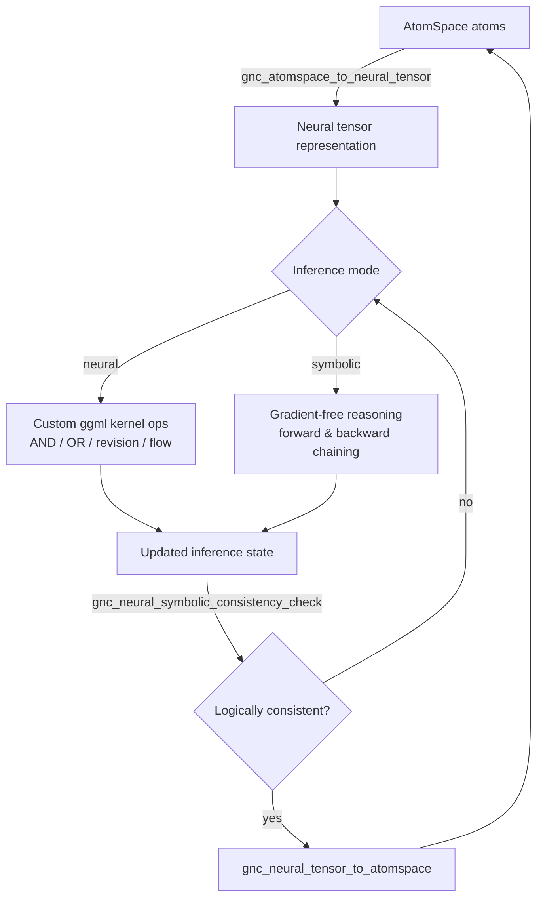

# Phase 3: Neural-Symbolic Synthesis via Custom ggml Kernels

This document describes the Phase 3 implementation of the Distributed Agentic
Cognitive Grammar Network: custom ggml kernels for seamless neural-symbolic
computation and inference in the GnuCash Cognitive Engine.

## Overview

Phase 3 bridges symbolic reasoning (AtomSpace, PLN, ECAN) and neural
computation (ggml tensor networks) through a set of custom kernels that
operate directly on `GncTensorData` tensors while preserving logical
consistency. When the ggml library is available (`HAVE_GGML`), kernels attach
a `ggml_context` for accelerated computation; otherwise a functionally
identical CPU fallback path is used — there are no mocks or simulated
results in either path.

Implementation files:

| File | Purpose |
|---|---|
| `libgnucash/engine/gnc-neural-symbolic-kernels.h` | Public kernel API |
| `libgnucash/engine/gnc-neural-symbolic-kernels.cpp` | Kernel implementation |
| `libgnucash/engine/test/test-neural-symbolic-kernels.cpp` | Verification suite (12 tests) |
| `neural-symbolic-synthesis-demo.cpp` | End-to-end demonstration program |

The kernel system is initialized automatically from
`gnc_cognitive_accounting_init()` (after the tensor network) and shut down
from `gnc_cognitive_accounting_shutdown()`.

## Kernel API

### Lifecycle

```c
gboolean gnc_neural_symbolic_kernels_init(void);
void     gnc_neural_symbolic_kernels_shutdown(void);

GncNeuralSymbolicKernel* gnc_neural_symbolic_kernel_create(GncSymbolicOpType op_type);
void     gnc_neural_symbolic_kernel_destroy(GncNeuralSymbolicKernel *kernel);
gboolean gnc_neural_symbolic_kernel_register(GncNeuralSymbolicKernel *kernel);
```

### Symbolic tensor operations

All operations are gradient-free, logic-preserving element-wise or matrix
transformations over `GncTensorData` (float32):

| Operation | Function | Semantics |
|---|---|---|
| `GNC_SYMBOLIC_OP_LOGICAL_AND` | `gnc_symbolic_tensor_logical_and` | Fuzzy conjunction of truth-value tensors |
| `GNC_SYMBOLIC_OP_LOGICAL_OR` | `gnc_symbolic_tensor_logical_or` | Fuzzy disjunction of truth-value tensors |
| `GNC_SYMBOLIC_OP_TRUTH_REVISION` | `gnc_symbolic_tensor_truth_revision` | PLN truth-value revision (prior ⊕ evidence) |
| `GNC_SYMBOLIC_OP_ATTENTION_FLOW` | `gnc_symbolic_tensor_attention_flow` | Conservative ECAN attention flow dynamics |
| `GNC_SYMBOLIC_OP_PATTERN_MATCH` | `gnc_symbolic_tensor_pattern_match` | Cosine-similarity pattern matching |
| `GNC_SYMBOLIC_OP_SYMBOLIC_UNIFY` | `gnc_symbolic_tensor_unify` | Symbolic unification of concept tensors |

#### Attention flow conservation

The attention-flow kernel implements a *conservative* update:

```
A'[i] = clamp( A[i] + Σⱼ ( M[j,i]·A[j] − M[i,j]·A[i] ) · dt , 0.01, ∞ )
```

where `M` is the `n×n` flow matrix (`M[i,j]` = outflow rate from node `i` to
node `j`) and `dt = 0.1`. High-attention source nodes therefore *lose*
attention to their targets, matching OpenCog ECAN economics.

### Neural-symbolic inference engine

```c
GncNeuralSymbolicInference* gnc_neural_symbolic_inference_create(void);
void     gnc_neural_symbolic_inference_destroy(GncNeuralSymbolicInference *inference);
gboolean gnc_neural_symbolic_inference_step(...);   /* single hybrid step   */
gboolean gnc_neural_symbolic_inference_chain(...);  /* full reasoning chain */
gboolean gnc_neural_symbolic_inference_switch_mode(...); /* neural ↔ symbolic */
```

### AtomSpace integration hooks

```c
gboolean gnc_atomspace_to_neural_tensor(GncAtomHandle, GncTensorData*);
gboolean gnc_neural_tensor_to_atomspace(GncTensorData*, GncAtomHandle*);
gboolean gnc_atomspace_neural_compute(GList *atoms, GncNeuralSymbolicInference*, GList **results);
gboolean gnc_neural_symbolic_consistency_check(GncTensorData*, GList *atoms, gdouble *score);
```

Atom handles (`guint64`) are carried in `GList` payloads via
`GSIZE_TO_POINTER`/`GPOINTER_TO_SIZE`.

### Cognitive primitive operations

- `gnc_cognitive_primitive_concept_formation` — feature tensor → concept tensor
- `gnc_cognitive_primitive_category_learning` — examples tensor → category prototype
- `gnc_cognitive_primitive_analogical_reasoning` — source/target → analogy mapping
- `gnc_cognitive_primitive_causal_reasoning` — event sequence → causal strengths

### Gradient-free symbolic reasoning

`GncGradientFreeReasoning` supports rule application, forward chaining and
backward chaining over truth-value tensors without any gradient computation
(`gnc_gradient_free_apply_rule`, `gnc_gradient_free_forward_chain`,
`gnc_gradient_free_backward_chain`).

## Tensor Shapes

| Use case | Shape | Notes |
|---|---|---|
| Truth-value vectors | `[N]` | strength values in `[0,1]` |
| Inference state | `[512]` | created by the inference engine |
| Attention state | `[n_nodes]` | one STI value per node |
| Attention flow matrix | `[n_nodes, n_nodes]` | row = source, column = target |
| Pattern / data tensors | `[D]` (e.g. `[128]`) | cosine similarity in `match_scores[1]` |
| Financial feature frames | `[frames, features]` | encoded from real transactions |

## Performance Benchmarking

`gnc_neural_symbolic_kernel_benchmark()` fills a
`GncKernelPerformanceMetrics` structure with real measured values:
computation time (ms), memory usage (bytes), logical accuracy, neural
convergence, operation count, and throughput (ops/sec).
`gnc_tensor_operation_memory_profile()` reports peak and steady-state memory
for each operation type, and `gnc_tensor_signature_validate()` verifies
tensor shape signatures against expected declarations.

## Symbolic ↔ Neural Pathway Recursion



## Verification Protocol

Build and run the test suite (12 tests, all using real tensor data):

```bash
mkdir build && cd build
cmake -G Ninja ..
ninja test-neural-symbolic-kernels
./bin/test-neural-symbolic-kernels
```

Test coverage: kernel init, logical ops, truth revision, attention flow
(including conservation), pattern matching, inference engine, AtomSpace
integration, cognitive primitives, performance benchmarking, tensor
signature validation, gradient-free reasoning, and the end-to-end
neural-symbolic pipeline.

The full demonstration pipeline:

```bash
ninja neural-symbolic-synthesis-demo
./bin/neural-symbolic-synthesis-demo
```

## Dependencies

- Phase 1: Cognitive Primitives & Foundational Hypergraph Encoding
  (`gnc-cognitive-primitives.*`, see `PHASE1_KO6ML_TRANSLATION.md`)
- Phase 2: ECAN Attention Allocation & Resource Kernel Construction
  (`gnc_ecan_*` API in `gnc-cognitive-accounting.*`)
- Distributed tensor network (`gnc-tensor-network.*`,
  see `TENSOR_NETWORK_ARCHITECTURE.md`)
- Optional: ggml library (detected at configure time; CPU fallback otherwise)

---
Part of the Distributed Agentic Cognitive Grammar Network development cycle.
